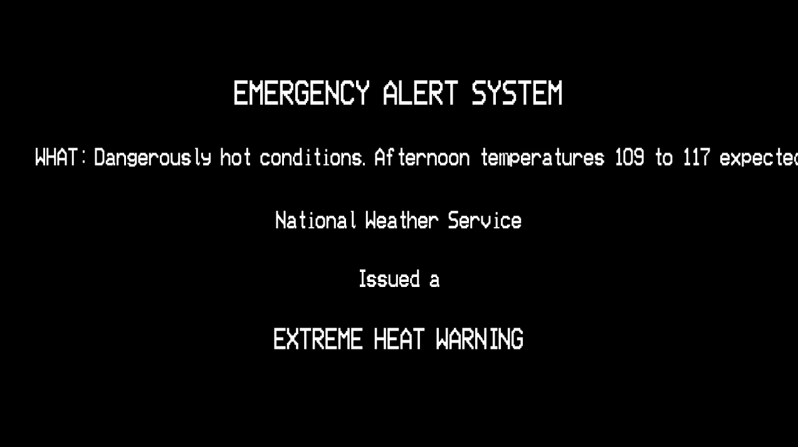
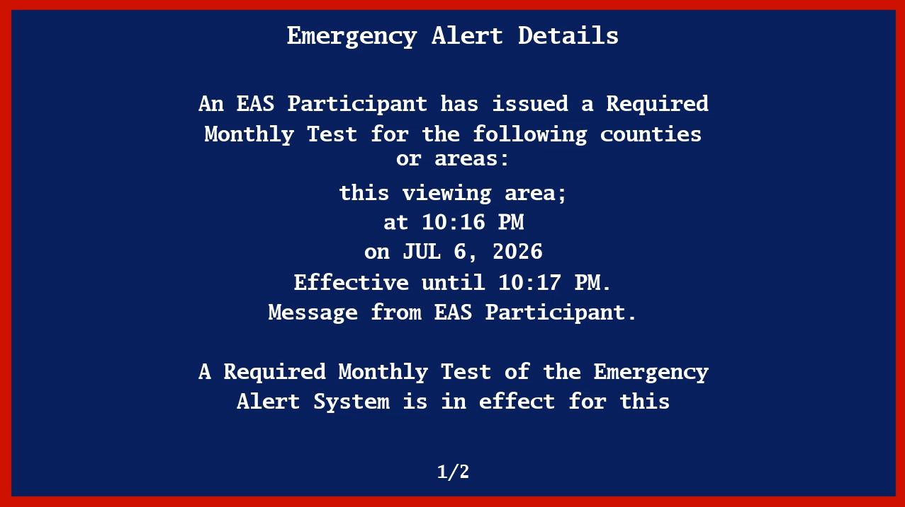
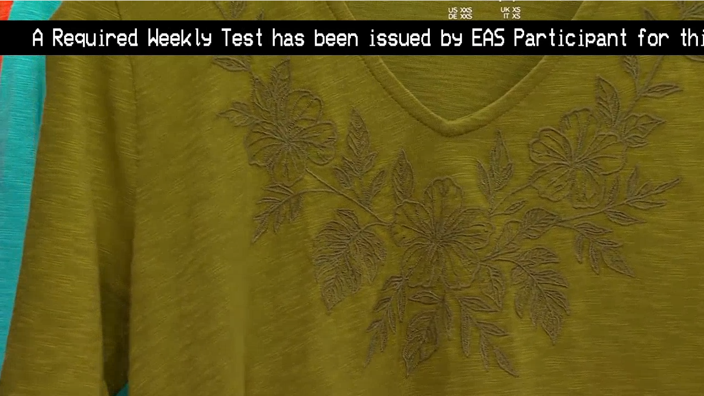
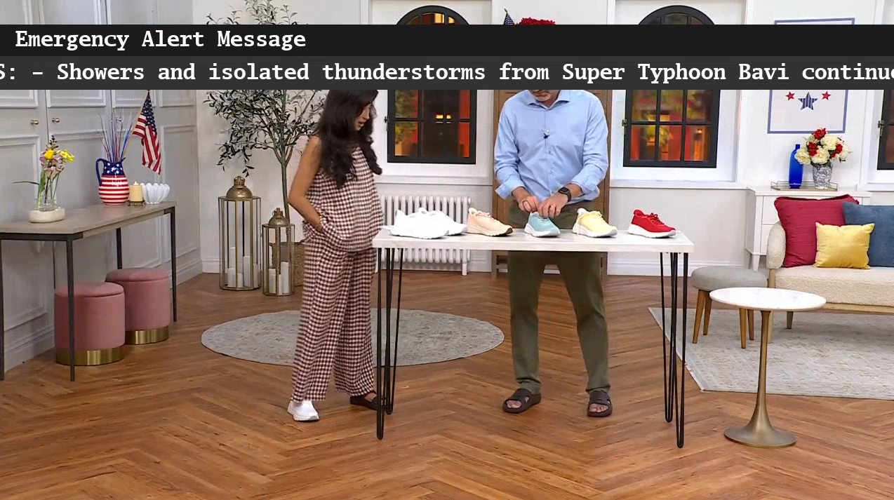

# EmergencyAlertArr

An EAS plugin for Dispatcharr(https://github.com/Dispatcharr/Dispatcharr). It watches the NWS and
IPAWS feeds for active alerts, and when one is issued for your area it interrupts whatever channel
you're watching with a broadcast-style EAS screen and the real SAME/attention tones — then restores
the stream once the alert clears.

It's basically a software ENDEC for your IPTV setup. If you've ever wanted your channels to behave
like real cable during a weather warning, that's the idea.

## What it does

- Polls the National Weather Service (`api.weather.gov`) and/or FEMA IPAWS-OPEN for active alerts.
- Filters them down to your area by NWS zone/county codes (NWS) and 6-digit SAME/FIPS codes (IPAWS).
- When a new alert fires on a channel that someone is actually watching, it swaps in an overlay
  profile: a broadcast-style alert screen, the real EAS tones, and an optional spoken readout of the
  alert text.
- Restores the original stream once the alert sequence finishes.

Alerts play one at a time. Nothing fires on channels nobody's tuned to, and everything self-restores
even if the viewer wanders off mid-alert.

## Overlay styles

<table>
<tr>
<td align="center" width="50%">

<strong>EASyPlus</strong>  

  

Full-screen black takeover with centered white text and a scrolling line.

</td>

<td align="center" width="50%">

<strong>DASDEC</strong>  

  

Navy ENDEC-style screen with a red border and paginated alert text.

</td>
</tr>

<tr>
<td align="center">

<strong>EASyPlus Ticker</strong>  

  

Program continues playing underneath with a scrolling alert banner.

</td>

<td align="center">

<strong>DASDEC Scroll</strong>  

  

Gray two-row ENDEC-style crawl while the program remains visible.

</td>
</tr>
</table>

## Install

Drop the `emergencyalertarr` folder into your Dispatcharr `plugins` directory — it's self-contained.
Then open the plugin settings and:

1. Pick your **Alert Source** (NWS, IPAWS, or both) and fill in the matching codes. You have to set
   codes for whichever source you turn on — the Enable button will tell you if something's missing.
2. Choose an overlay style, tone options, and (optionally) tune the lead-in.
3. Select which channels to monitor under **Channels to Monitor** and hit **Enable EAS**.

## Configuration notes

- **EAS-only filter** — the NWS sends a lot of stuff that a real encoder never relays (heat
  advisories, air-quality alerts, etc.). Turn this on to fire only on products that would actually
  hit EAS. There are also allow/block lists if you want to narrow it down to specific event codes
  like TOR, SVR, FFW. National alerts (EAN/NPT/PEP) always come through.
- **Overlay Lead-in** — the tones are instant but the picture takes a few seconds to reconnect after
  the profile swap, so without a lead-in the header tones play over a blank screen. The lead-in holds
  silence until the overlay is actually up. Set it roughly to how long your channels take to come
  back; 4 seconds is a reasonable start.
- **Transcode Quality** — the overlay requires re-encoding, so a channel uses more CPU while an alert
  is active (only then). If an alert stutters, step this down. High-framerate sources cost about
  double.

## Actions

- **Enable / Disable EAS** — arm or unarm the selected channels.
- **Test EAS Alert** — fire an RWT/RMT on whatever channel you're currently watching.
- **Inject Custom Alert** — broadcast your own alert from the injection settings.
- **Fetch Alerts Now** — poll immediately instead of waiting for the timer, and see exactly what came
  back (new vs already-played, per source). Handy for confirming it's actually polling.
- **View Active Alerts / View & Clear History / Reset All EAS / Redis Diagnostics / Reload Poller /
  Restart Dispatcharr** — the usual housekeeping.
  
## Known issues

- The scheduled-test loop can occasionally throw a Django "list index out of range" from a stale DB
  connection in the background thread. It's caught and logged, doesn't affect alerts, and is on the
  list to fix with `close_old_connections()`.

## Responsible use

This generates the real EAS tones, so keep it on your own private setup. The SAME and attention tones
are the genuine article — don't point the test or inject features at anything public, and don't
rebroadcast the tones anywhere they could be mistaken for an actual alert.
